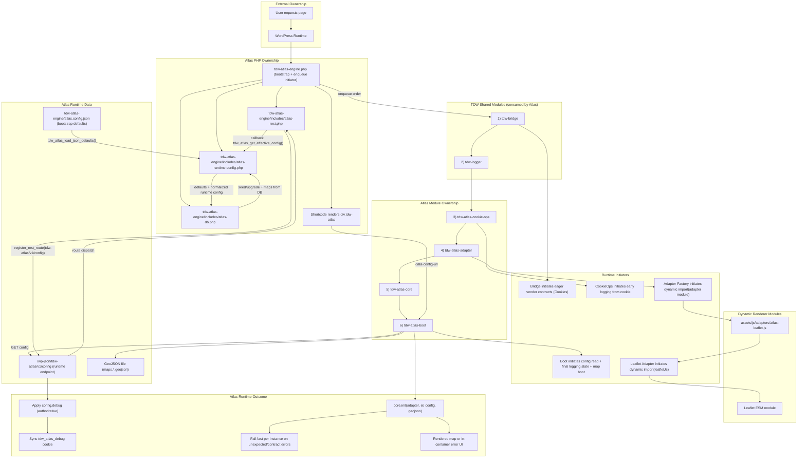

# TDW Atlas Module Graph

```mermaid
flowchart TD
  subgraph EXT["External Ownership"]
    U["User requests page"]
    WP["WordPress Runtime"]
  end

  subgraph PHPC["Atlas PHP Ownership"]
    PHP["tdw-atlas-engine.php (bootstrap + enqueue initiator)"]
    PRC["tdw-atlas-engine/includes/atlas-runtime-config.php"]
    PDB["tdw-atlas-engine/includes/atlas-db.php"]
    PREST["tdw-atlas-engine/includes/atlas-rest.php"]
    C["Shortcode renders div.tdw-atlas"]
  end

  subgraph SHARED["TDW Shared Modules (consumed by Atlas)"]
    M1["1) tdw-bridge"]
    M2["2) tdw-logger"]
  end

  subgraph ATLAS["Atlas Module Ownership"]
    M3["3) tdw-atlas-cookie-ops"]
    M4["4) tdw-atlas-adapter"]
    M5["5) tdw-atlas-core"]
    M6["6) tdw-atlas-boot"]
  end

  subgraph DATA["Atlas Runtime Data"]
    CFG["/wp-json/tdw-atlas/v1/config (runtime endpoint)"]
    BOOTCFG["tdw-atlas-engine/atlas.config.json (bootstrap defaults)"]
    GEO["GeoJSON file (maps.*.geojson)"]
  end

  subgraph VENDOR["Dynamic Renderer Modules"]
    V1["assets/js/adapters/atlas-leaflet.js"]
    V2["Leaflet ESM module"]
  end

  subgraph INIT["Runtime Initiators"]
    I1["Bridge initiates eager vendor contracts (Cookies)"]
    I2["CookieOps initiates early logging from cookie"]
    I3["Boot initiates config read + final logging state + map boot"]
    I4["Adapter Factory initiates dynamic import(adapter module)"]
    I5["Leaflet Adapter initiates dynamic import(leafletJs)"]
  end

  subgraph RENDER["Atlas Runtime Outcome"]
    DBG["Apply config.debug (authoritative)"]
    CK["Sync tdw_atlas_debug cookie"]
    R["core.init(adapter, el, config, geojson)"]
    FF["Fail-fast per instance on unexpected/contract errors"]
    MAP["Rendered map or in-container error UI"]
  end

  U --> WP
  WP --> PHP
  PHP --> PRC
  PHP --> PDB
  PHP --> PREST
  PHP --> C
  PHP -->|"enqueue order"| M1
  M1 --> M2
  M2 --> M3
  M3 --> M4
  M4 --> M5
  M5 --> M6

  M1 --> I1
  M3 --> I2
  M6 --> I3
  M4 --> I4
  I4 --> V1
  V1 --> I5
  I5 --> V2

  C -->|"data-config-url"| M6
  M6 -->|"GET config"| CFG
  CFG -->|"route dispatch"| PREST
  PREST -->|"register_rest_route(tdw-atlas/v1/config)"| CFG
  PREST -->|"callback: tdw_atlas_get_effective_config()"| PRC
  BOOTCFG -->|"tdw_atlas_load_json_defaults()"| PRC
  PRC -->|"defaults + normalized runtime config"| PDB
  PDB -->|"seed/upgrade + maps from DB"| PRC
  CFG --> DBG
  DBG --> CK
  M6 --> GEO
  M6 --> R
  R --> FF
  R --> MAP
```
