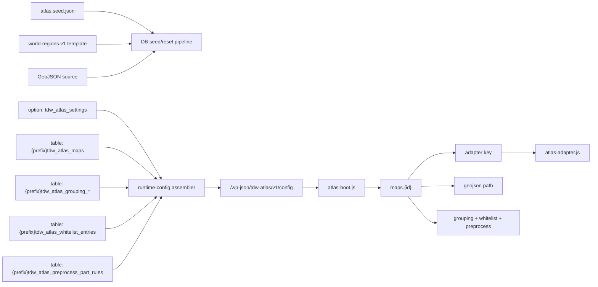

# Config Dataflow Diagram

```mermaid
flowchart LR
  JSON["atlas.seed.json"] --> SEED["DB seed/reset pipeline"]
  TPL["world-regions.v1 template"] --> SEED
  GEO["GeoJSON source"] --> SEED
  O1["option: tdw_atlas_settings"] --> RC["runtime-config assembler"]
  T1["table: {prefix}tdw_atlas_maps"] --> RC
  T2["table: {prefix}tdw_atlas_grouping_*"] --> RC
  T3["table: {prefix}tdw_atlas_whitelist_entries"] --> RC
  T4["table: {prefix}tdw_atlas_preprocess_part_rules"] --> RC
  RC --> REST["/wp-json/tdw-atlas/v1/config"]
  REST --> BOOT["atlas-boot.js"]
  BOOT --> MAP["maps.{id}"]
  MAP --> ADPKEY["adapter key"]
  MAP --> GEO2["geojson path"]
  MAP --> META["grouping + whitelist + preprocess"]
  ADPKEY --> AF["atlas-adapter.js"]
```
