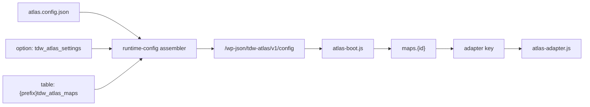

# Config Dataflow Diagram

```mermaid
flowchart LR
  JSON["atlas.config.json"] --> RC["runtime-config assembler"]
  O1["option: tdw_atlas_settings"] --> RC
  T1["table: {prefix}tdw_atlas_maps"] --> RC
  RC --> REST["/wp-json/tdw-atlas/v1/config"]
  REST --> BOOT["atlas-boot.js"]
  BOOT --> MAP["maps.{id}"]
  MAP --> ADPKEY["adapter key"]
  ADPKEY --> AF["atlas-adapter.js"]
```
