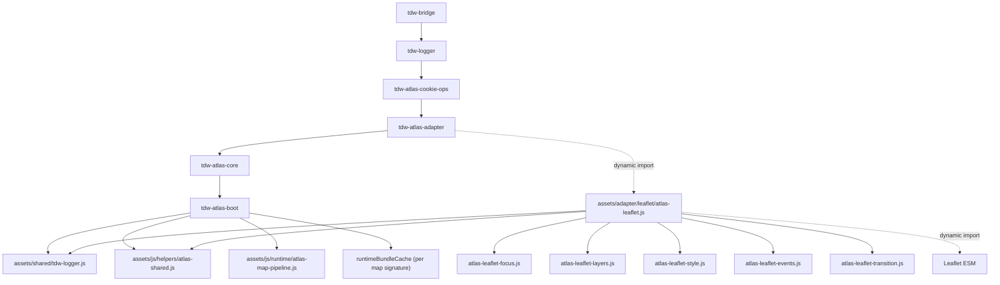

# Module Dependencies Diagram

```mermaid
flowchart TD
  M1["tdw-bridge"] --> M2["tdw-logger"]
  M2 --> M3["tdw-atlas-cookie-ops"]
  M3 --> M4["tdw-atlas-adapter"]
  M4 --> M5["tdw-atlas-core"]
  M5 --> M6["tdw-atlas-boot"]
  M6 --> H1["assets/shared/tdw-logger.js"]
  M6 --> H2["assets/js/helpers/atlas-shared.js"]
  M6 --> P1["assets/js/runtime/atlas-map-pipeline.js"]
  M6 --> C1["runtimeBundleCache (per map signature)"]
  M4 -."dynamic import".-> A1["assets/adapter/leaflet/atlas-leaflet.js"]
  A1 --> H1
  A1 --> H2
  A1 --> A2["atlas-leaflet-focus.js"]
  A1 --> A3["atlas-leaflet-layers.js"]
  A1 --> A4["atlas-leaflet-style.js"]
  A1 --> A5["atlas-leaflet-events.js"]
  A1 --> A6["atlas-leaflet-transition.js"]
  A1 -."dynamic import".-> V1["Leaflet ESM"]
```
