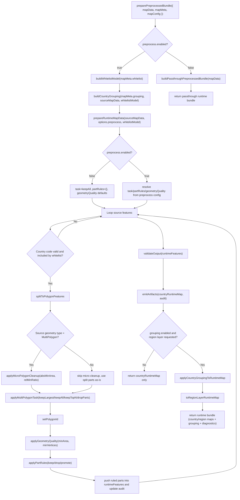

# Runtime Preprocessor Flow

This diagram mirrors the current processing chain in:
`assets/js/runtime/atlas-preprocessor.js`.

## Step-Order Testability Matrix

| Case | preprocess.enabled | whitelist.enabled | grouping.mode | partRules present | Expected runtime bundle |
| --- | --- | --- | --- | --- | --- |
| passthrough | `false` | any | any | any | country map only passthrough, grouping/whitelist/part-rules ignored |
| grouped-set | `true` | `true` | `set` | `false` | country + optional region layer from set mapping |
| grouped-geojson | `true` | `true` | `geojson` | `false` | country + optional region layer from GeoJSON property |
| ungrouped | `true` | `true` | `off` | `false` | country map only, no region layer |
| part-rules | `true` | `true` | `set` | `true` | country map reflects keep/drop/promote overrides before grouping layer build |
| whitelist-off | `true` | `false` | `set` | `false` | whitelist step bypassed, grouping still applied |

## Admin Mapping Matrix (Residual #32)

| Future Admin control | Runtime field | Pipeline impact |
| --- | --- | --- |
| Enable preprocess | `maps.{id}.preprocess.enabled` | selects passthrough vs full preprocess branch |
| Enable whitelist | `maps.{id}.whitelist.enabled` | include/exclude gate in whitelist step |
| Grouping mode selector | `maps.{id}.grouping.mode` | chooses `set`, `geojson`, or `off` grouping path |
| Grouping set selector | `maps.{id}.grouping.setKey` | resolves `countryToRegion` source for `set` mode |
| GeoJSON grouping property | `maps.{id}.grouping.geojsonProperty` | resolves grouping key for `geojson` mode |
| Multipolygon default task | `maps.{id}.preprocess.multiPolygon.default` | selects keep/drop strategy after split |
| Multipolygon country override | `maps.{id}.preprocess.multiPolygon.countries[ISO2]` | per-country task override |
| Micro cleanup thresholds | `maps.{id}.preprocess.microPolygonCleanup.*` | drop tiny split parts before task |
| Part rules editor | `maps.{id}.preprocess.partRules[]` | explicit keep/drop/promote override stage |

## Ownership Matrix

| Concern | Owner |
| --- | --- |
| Container discovery, config fetch, cache key | Boot (`assets/js/atlas-boot.js`) |
| GeoJSON transformation, whitelist/grouping/preprocess | Preprocessor (`assets/js/runtime/atlas-preprocessor.js`) |
| Stage machine, layer mount, pointer events, preview coupling | Adapter (`assets/adapter/leaflet/*.js`) |
