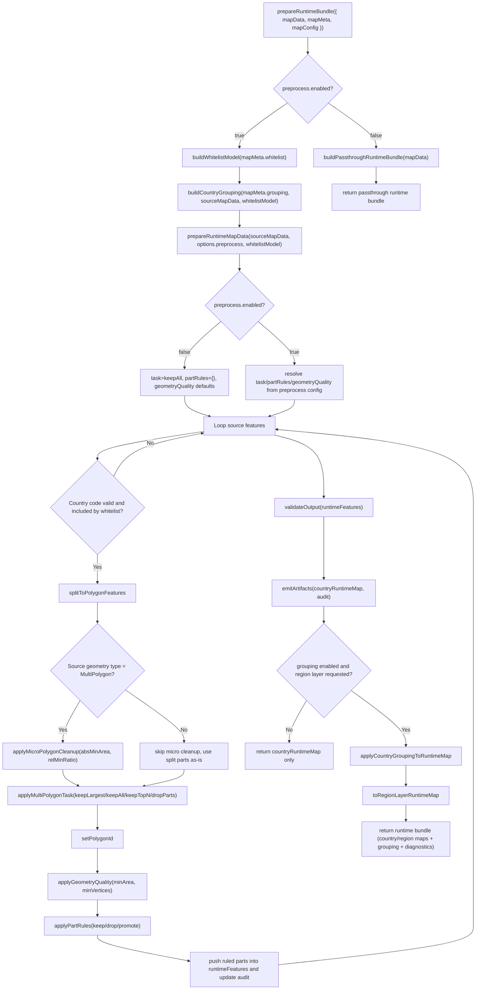

# Runtime Pipeline Flow

This diagram mirrors the current processing chain in:
`assets/js/runtime/atlas-map-pipeline.js`.

```mermaid
flowchart TD
  A["prepareRuntimeBundle({ mapData, mapMeta, mapConfig })"] --> A0{"preprocess.enabled?"}
  A0 -- "false" --> P0["buildPassthroughRuntimeBundle(mapData)"]
  A0 -- "true" --> B["buildWhitelistModel(mapMeta.whitelist)"]
  B --> C["buildCountryGrouping(mapMeta.grouping, sourceMapData, whitelistModel)"]
  C --> D["prepareRuntimeMapData(sourceMapData, options.preprocess, whitelistModel)"]
  D --> E{"preprocess.enabled?"}
  E -- "false" --> E0["task=keepAll, partRules={}, geometryQuality defaults"]
  E -- "true" --> E1["resolve task/partRules/geometryQuality from preprocess config"]
  E0 --> F["Loop source features"]
  E1 --> F

  F --> G{"Country code valid and included by whitelist?"}
  G -- "No" --> F
  G -- "Yes" --> H["splitToPolygonFeatures"]
  H --> I{"Source geometry type = MultiPolygon?"}
  I -- "Yes" --> J["applyMicroPolygonCleanup(absMinArea, relMinRatio)"]
  I -- "No" --> K["skip micro cleanup, use split parts as-is"]
  J --> L["applyMultiPolygonTask(keepLargest/keepAll/keepTopN/dropParts)"]
  K --> L
  L --> M["setPolygonId"]
  M --> N["applyGeometryQuality(minArea, minVertices)"]
  N --> O["applyPartRules(keep/drop/promote)"]
  O --> O1["push ruled parts into runtimeFeatures and update audit"]
  O1 --> F

  F --> P["validateOutput(runtimeFeatures)"]
  P --> Q["emitArtifacts(countryRuntimeMap, audit)"]
  Q --> R{"grouping enabled and region layer requested?"}
  R -- "No" --> S["return countryRuntimeMap only"]
  R -- "Yes" --> T["applyCountryGroupingToRuntimeMap"]
  T --> U["toRegionLayerRuntimeMap"]
  U --> V["return runtime bundle (country/region maps + grouping + diagnostics)"]
  P0 --> V0["return passthrough runtime bundle"]
```
