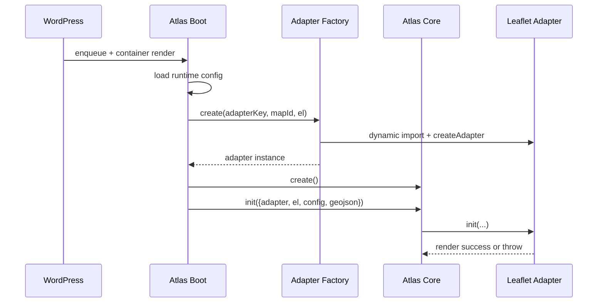

# Runtime Sequence Diagram

```mermaid
sequenceDiagram
  participant WP as WordPress
  participant BOOT as Atlas Boot
  participant AF as Adapter Factory
  participant CORE as Atlas Core
  participant ADP as Leaflet Adapter

  WP->>BOOT: enqueue + container render
  BOOT->>BOOT: load runtime config
  BOOT->>AF: create(adapterKey, mapId, el)
  AF->>ADP: dynamic import + createAdapter
  AF-->>BOOT: adapter instance
  BOOT->>CORE: create()
  BOOT->>CORE: init({adapter, el, config, geojson})
  CORE->>ADP: init(...)
  ADP-->>CORE: render success or throw
```
