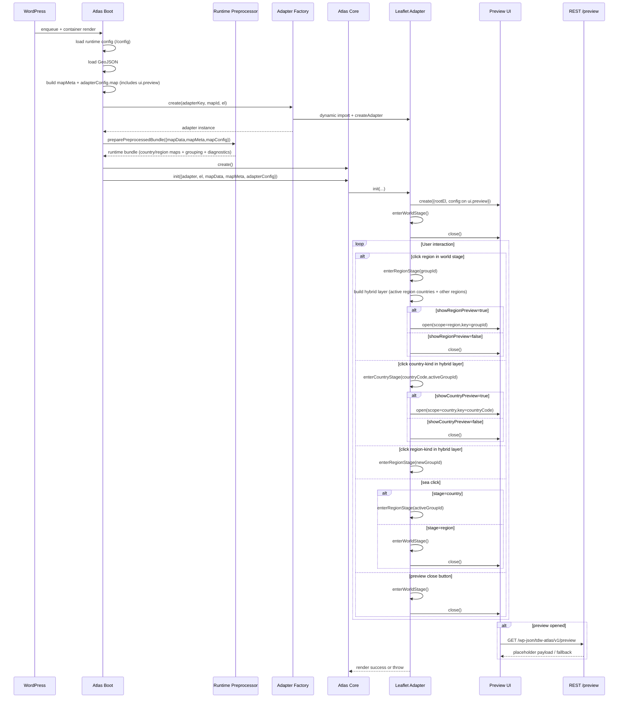

# Runtime Sequence Diagram

```mermaid
sequenceDiagram
  participant WP as WordPress
  participant BOOT as Atlas Boot
  participant PIPE as Runtime Preprocessor
  participant AF as Adapter Factory
  participant CORE as Atlas Core
  participant ADP as Leaflet Adapter
  participant PUI as Preview UI
  participant API as REST /preview

  WP->>BOOT: enqueue + container render
  BOOT->>BOOT: load runtime config (/config)
  BOOT->>BOOT: load GeoJSON
  BOOT->>BOOT: build mapMeta + adapterConfig.map (includes ui.preview)
  BOOT->>AF: create(adapterKey, mapId, el)
  AF->>ADP: dynamic import + createAdapter
  AF-->>BOOT: adapter instance
  BOOT->>PIPE: preparePreprocessedBundle({mapData,mapMeta,mapConfig})
  PIPE-->>BOOT: runtime bundle (country/region maps + grouping + diagnostics)
  BOOT->>CORE: create()
  BOOT->>CORE: init({adapter, el, mapData, mapMeta, adapterConfig})
  CORE->>ADP: init(...)
  ADP->>PUI: create({rootEl, config:on ui.preview})
  ADP->>ADP: enterWorldStage()
  ADP->>PUI: close()

  loop User interaction
    alt click region in world stage
      ADP->>ADP: enterRegionStage(groupId)
      ADP->>ADP: build hybrid layer (active region countries + other regions)
      alt showRegionPreview=true
        ADP->>PUI: open(scope=region,key=groupId)
      else showRegionPreview=false
        ADP->>PUI: close()
      end
    else click country-kind in hybrid layer
      ADP->>ADP: enterCountryStage(countryCode,activeGroupId)
      alt showCountryPreview=true
        ADP->>PUI: open(scope=country,key=countryCode)
      else showCountryPreview=false
        ADP->>PUI: close()
      end
    else click region-kind in hybrid layer
      ADP->>ADP: enterRegionStage(newGroupId)
    else sea click
      alt stage=country
        ADP->>ADP: enterRegionStage(activeGroupId)
      else stage=region
        ADP->>ADP: enterWorldStage()
        ADP->>PUI: close()
      end
    else preview close button
      ADP->>ADP: enterWorldStage()
      ADP->>PUI: close()
    end
  end

  alt preview opened
    PUI->>API: GET /wp-json/tdw-atlas/v1/preview
    API-->>PUI: placeholder payload / fallback
  end
  ADP-->>CORE: render success or throw
```
