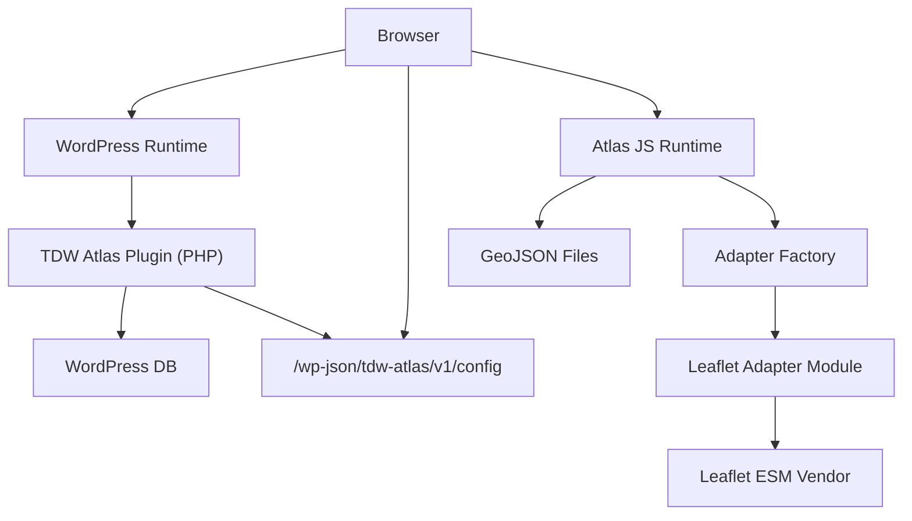

# System Environment Diagram

```mermaid
flowchart TD
  B["Browser"] --> WP["WordPress Runtime"]
  WP --> P["TDW Atlas Plugin (PHP)"]
  P --> DB["WordPress DB"]
  P --> REST["/wp-json/tdw-atlas/v1/config"]
  B --> REST
  B --> JS["Atlas JS Runtime"]
  JS --> ADP["Adapter Factory"]
  ADP --> LADP["Leaflet Adapter Module"]
  LADP --> LV["Leaflet ESM Vendor"]
  JS --> GEO["GeoJSON Files"]
```
